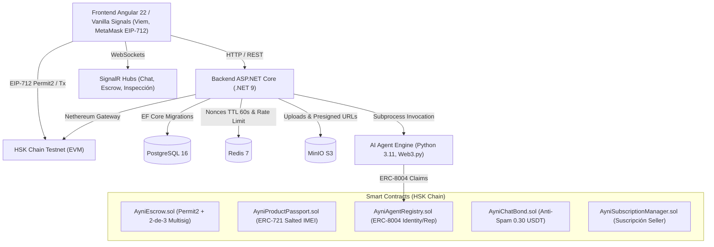

# Ayni Trust Marketplace 🛡️📦

Marketplace descentralizado P2P para compra y venta de hardware de alta gama y electrónicos garantizados mediante Smart Contracts de Escrow en **HSK Chain**, pasaportes digitales NFT (ERC-721), verificación automatizada por Agentes de IA (ERC-8004), bono de intención de chat anti-spam (0.30 USDT) y protocolo físico **Safe Meet QR** con entrega presencial libre de fraudes.

---

## 🏗️ Arquitectura del Sistema



- **On-Chain**: Smart contracts optimizados para Solidity `0.8.24` / EVM Cancun en HSK Testnet con soporte Uniswap Permit2, Checks-Effects-Interactions (CEI), ReentrancyGuard y salted hash commitments `keccak256(abi.encodePacked(imei, salt, seller))` para proteger la privacidad del número de serie o IMEI.
- **Backend API**: ASP.NET Core (.NET 9) con autenticación SIWE (Sign-In with Ethereum) y JWT, Entity Framework Core sobre PostgreSQL 16, Redis 7 (TTL 60s para nonces QR de entrega presencial), MinIO S3 para almacenamiento de evidencia/imágenes y motor desacoplado de agentes.
- **Frontend SPA**: Angular 22 con Vanilla Signals (`signal()`, `computed()`), sin dependencias pesadas de estado, integración reactiva con Viem, MetaMask EIP-712 y SignalR en tiempo real.
- **AI Agent Runner**: Motor en Python 3.11 con Google Gemini Flash y Web3.py para extracción de especificaciones de hardware y atestaciones bajo el estándar ERC-8004.

---

## 🚀 Inicio Rápido con Docker Compose (Recomendado)

Todo el ecosistema (PostgreSQL, Redis, MinIO, Backend API y Frontend) se encuentra 100% containerizado y configurado para desplegarse con un único comando en cualquier máquina sin instalaciones locales.

### Requisitos Previos
- [Docker](https://docs.docker.com/get-docker/) (v24.0+)
- [Docker Compose](https://docs.docker.com/compose/) (v2.20+)

### 1. Clonar el Repositorio
```bash
git clone https://github.com/Douke017/ayni-escraw.git
cd ayni-escraw
```

### 2. Configurar Variables de Entorno (Opcional)
Puedes utilizar la configuración por defecto o copiar el archivo de ejemplo:
```bash
cp .env.example .env
```

### 3. Levantar Todo el Stack
```bash
docker compose up --build -d
```

### 4. Acceso a los Servicios

| Servicio | URL Local | Credenciales por Defecto |
|---|---|---|
| **Frontend Web App** | [http://localhost:4200](http://localhost:4200) | Conectar MetaMask en HSK Testnet |
| **Backend REST API** | [http://localhost:5000](http://localhost:5000) | OpenAPI: `/openapi/v1.json` |
| **PostgreSQL 16** | `localhost:5432` | Usuario: `ayni_user` / Contraseña: `ayni_secure_pass_2026` / DB: `ayni_db` |
| **Redis 7** | `localhost:6379` | Sin contraseña |
| **MinIO Console** | [http://localhost:9001](http://localhost:9001) | Usuario: `ayni_minio_admin` / Pass: `ayni_minio_secret_pass_2026` |
| **MinIO S3 Storage** | [http://localhost:9000](http://localhost:9000) | Buckets automáticos creados por `minio-init` |

---

## 👥 Modelo de Usuarios, Roles y KYC

El marketplace implementa una gobernanza de roles clara y segura:

1. **Comprador (`Buyer`)**:
   - Asignado automáticamente a toda wallet al autenticarse vía SIWE (`POST /api/auth/verify`).
   - Capacidad de compra activa de forma predeterminada (`canBuy: true`).
2. **Vendedor (`Seller`)**:
   - Requiere completar el proceso de verificación de identidad KYC (`IsKycVerified = true`).
   - Una vez aprobado el KYC (`KycStatus = Approved`), el usuario cuenta simultáneamente con capacidades de compra y venta (`canBuy: true`, `canSell: true`).
   - El usuario puede alternar dinámicamente entre la vista de Comprador y Vendedor utilizando los botones `"Soy Comprador"` / `"Soy Vendedor"` en la interfaz (`POST /api/users/me/switch-role`).
   - Arquitectura desacoplada mediante `IKycService` lista para producción con el proveedor **Didit**.
3. **Árbitro (`Arbitrator`)**:
   - Rol reservado exclusivamente para la wallet de gobernanza/arbitraje configurada en `ARBITRATOR_ADDRESS`.
   - Posee facultades para participar en la resolución multifirma 2-de-3 de órdenes en disputa dentro del contrato `AyniEscrow.sol`.

---

## 🛡️ Endpoints Principales del Backend

### Autenticación y Usuarios (`/api/auth` y `/api/users`)
- `GET /api/auth/nonce?address=0x...`: Solicita nonce criptográfico para SIWE (EIP-4361).
- `POST /api/auth/verify`: Valida firma de MetaMask y emite JWT Bearer Token.
- `GET /api/users/me` *(Auth)*: Obtiene el perfil completo, estado de KYC y roles disponibles.
- `POST /api/users/me/switch-role` *(Auth)*: Alterna el rol activo entre `"Buyer"` y `"Seller"`.
- `POST /api/users/kyc/initiate` *(Auth)*: Inicia sesión de verificación Didit KYC (Workflow "Free KYC").
- `GET /api/users/kyc/status` *(Auth)*: Consulta el estado de aprobación del KYC.
- `POST /api/users/kyc/complete` *(Auth)*: Completa/simula verificación Didit KYC.
- `POST /api/webhooks/didit`: Webhook receptor de decisiones de Didit con validación HMAC-SHA256 (`X-Signature-V2`), timestamp freshness y canonicalización JSON.

### Catálogo y Productos (`/api/products`)
- `GET /api/products`: Lista publicaciones públicas con filtros por categoría, búsqueda y rango de precio.
- `GET /api/products/{id}`: Detalle de publicación y veredicto de atestación del agente.
- `GET /api/products/seller/{sellerAddress}`: Lista todas las publicaciones de un vendedor.
- `GET /api/products/my-listings` *(Auth)*: Lista las publicaciones pertenecientes a la wallet autenticada.
- `POST /api/products` *(Auth / Seller)*: Crea una publicación validando fotos, IMEI privado y prueba física (`ProofOfListing`).
- `PUT /api/products/{id}` *(Auth / Owner)*: Edita publicación. Protegido por ownership de wallet.
- `DELETE /api/products/{id}` *(Auth / Owner)*: Da de baja una publicación. Protegido por ownership de wallet.

### Escrow y Safe Meet (`/api/escrow`)
- `POST /api/escrow/orders`: Registra una nueva orden vinculada a un smart contract on-chain.
- `POST /api/escrow/orders/{id}/deposit-permit2`: Confirma el depósito EIP-712 Uniswap Permit2.
- `POST /api/escrow/safemeet/generate-qr` *(Auth)*: Genera nonce efímero de entrega física (TTL 60 segundos en Redis).
- `POST /api/escrow/safemeet/scan-qr` *(Auth)*: Valida y consume el nonce de forma atómica para confirmar el handoff.
- `POST /api/escrow/orders/{id}/release`: Aprueba y libera los fondos retenidos en Escrow.
- `POST /api/escrow/orders/{id}/dispute`: Inicia disputa formal para arbitraje 2-de-3.

### Chat con Bono de Intención (`/api/chatbond`)
- `POST /api/chatbond/{orderId}/deposit`: Registra el depósito anti-spam on-chain de 0.30 USDT.
- `GET /api/chatbond/{orderId}/status`: Monitorea el intercambio mutuo de mensajes (2 comprador / 2 vendedor) para habilitar el reembolso.
- `GET /api/chatbond/{orderId}/messages`: Consulta historial de mensajes del canal.

---

## 💻 Desarrollo Local (Sin Docker para Backend/Frontend)

Si prefieres ejecutar los servicios en tu máquina local para depurar con tu IDE:

### 1. Levantar solo la infraestructura de apoyo
```bash
docker compose up postgres redis minio minio-init -d
```

### 2. Ejecutar el Backend (.NET 9)
```bash
cd backend/src/Ayni.Api
dotnet run
```
*Las migraciones de Entity Framework Core se aplicarán automáticamente contra PostgreSQL en el arranque.*

### 3. Ejecutar el Frontend (Angular 22)
```bash
cd frontend
npm install
npm start
```
Abrir `http://localhost:4200` en el navegador.

---

## 🧪 Ejecución de Pruebas

### Pruebas del Backend (24 tests unitarios y de integración)
```bash
dotnet test backend/tests/Ayni.Tests/Ayni.Tests.csproj
```

### Pruebas de Smart Contracts (55 tests en Foundry)
```bash
cd contracts
forge test -vv
```

### Build del Frontend
```bash
cd frontend
npm run build
```

---

## 🌐 Configuración Web3 (HSK Testnet)

| Parámetro | Valor |
|---|---|
| **Nombre de Red** | HSK Testnet |
| **RPC URL** | `https://testnet.hsk.xyz` |
| **Chain ID** | `133` |
| **Símbolo** | HSK |
| **Explorador** | [https://testnet-explorer.hskchain.net](https://testnet-explorer.hskchain.net) |
| **Token USDT** | `0x69F391d998e9AbA14Cc9FA702be9Cf7b1D03d7f0` |
| **Uniswap Permit2** | `0x000000000022D473030F116dDEE9F6B43aC78BA3` |
| **AyniEscrow** | `0x03A5FE6351fB58C28CB5907752a46f8b13ffAD00` |
| **AyniProductPassport** | `0x618197F71C3e6B79489763BA7DD2A3f0d19FB344` |
| **AyniAgentRegistry** | `0x7C9842A474Ad2da1a74FDe2D448fAcf393be54b2` |
| **AyniChatBond** | `0x6023E014c95f080A5ebA00723e610C3bdbf0dC81` |
| **AyniSubscriptionManager** | `0xBa8FD902f65DeF3153CbD609842CAfe3FD058c78` |

---

## 📄 Licencia

Este proyecto está licenciado bajo los términos de la licencia [MIT](LICENSE).
