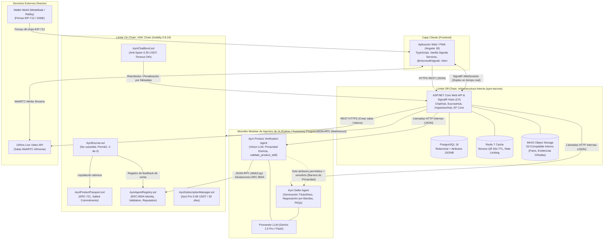
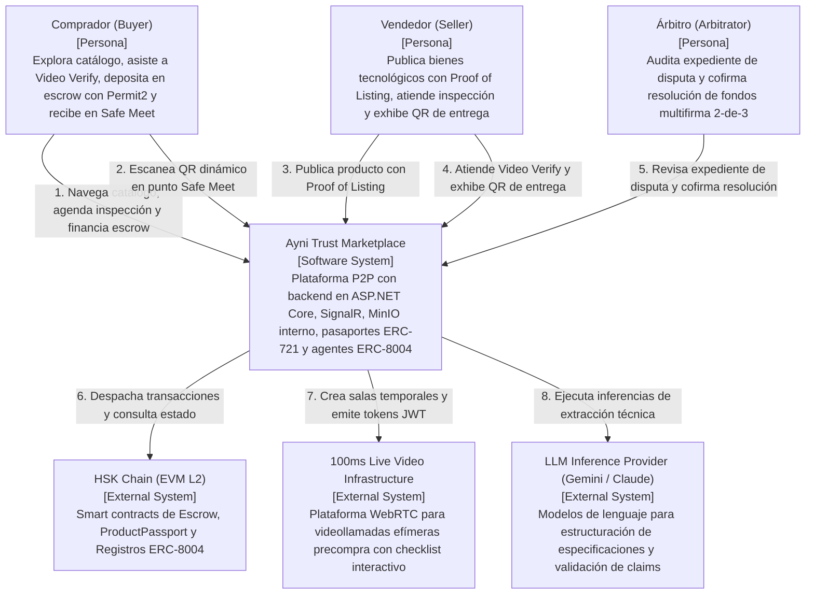
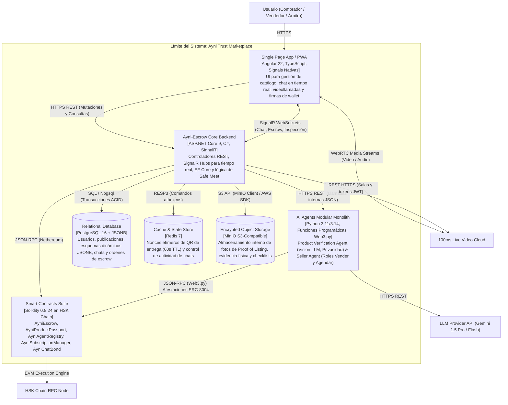
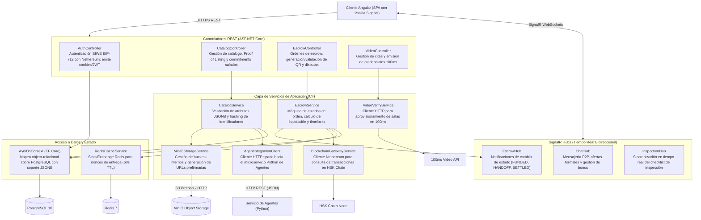
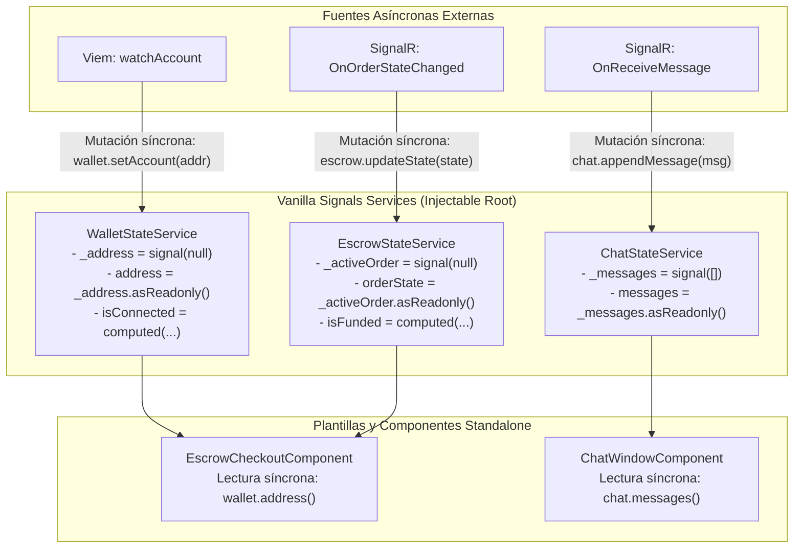
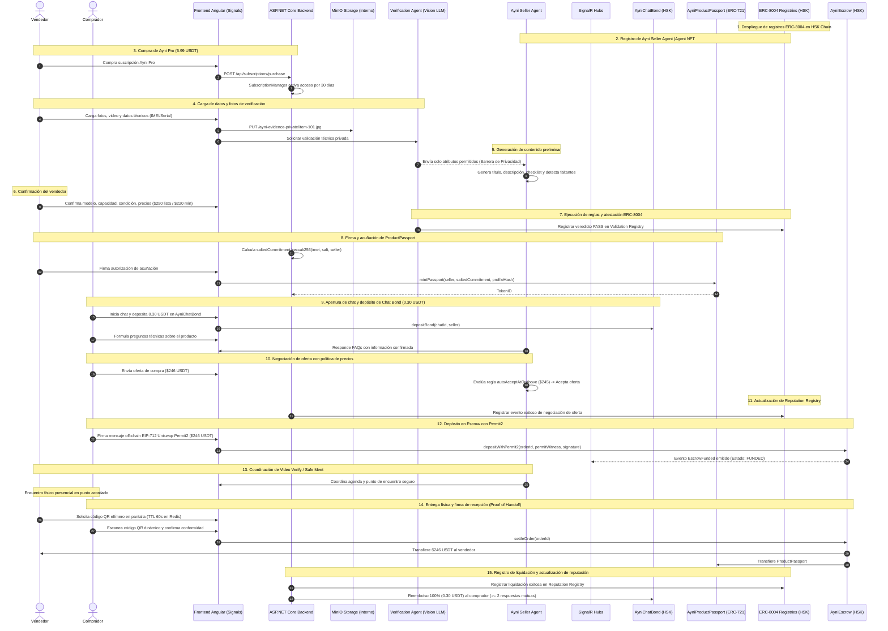

# Documento de Arquitectura — Ayni Trust Marketplace (Ayni-Scrow)

**Estado:** Propuesta técnica consolidada para revisión y aprobación  
**Sistema:** Plataforma de Comercio P2P Verificable para Bienes Tecnológicos sobre HSK Chain  
**Formato:** Markdown técnico formal  
**Alcance de esta versión:** Arquitectura simplificada y pragmática sin sobreingeniería (eliminación de EDA compleja y ACLs redundantes). Límite off-chain con backend en ASP.NET Core (C#) y comunicación bidireccional en tiempo real gobernada por SignalR; frontend en Angular 18 con gestión de estado basada exclusivamente en Vanilla Signals Services nativos (sin dependencias de NgRx ni `toSignal`); persistencia interna con PostgreSQL 16, Redis 7 y almacenamiento de objetos interno con MinIO (S3-compatible dentro del mismo boundary de infraestructura); límite on-chain con contratos inteligentes en Solidity desplegados en HSK Chain (AyniEscrow con Permit2, AyniProductPassport ERC-721 y registros ERC-8004); servicio autónomo de agentes de inteligencia artificial en Python con interacción directa con ERC-8004; integraciones externas directas con 100ms para videollamadas efímeras y autenticación descentralizada con Wallet (SIWE / EIP-712).

---

## 1. Resumen ejecutivo

**Ayni Trust Marketplace** es una plataforma de comercio descentralizado persona a persona (P2P) para la compraventa segura de artículos tecnológicos de alto valor e individualizables (smartphones, laptops, componentes electrónicos y accesorios tecnológicos rastreables). La arquitectura está diseñada para mitigar la **doble asimetría de confianza** entre partes desconocidas mediante una infraestructura técnica transparente, auditable y con cero custodia de claves privadas.

La solución se estructura a través de tres roles formales y una arquitectura híbrida claramente demarcada:

1. **Roles del Sistema:**
   * **Comprador (Buyer):** Explora el catálogo de productos, bloquea el Bono de Intención Conversacional (0.30 USDT) para abrir chat, participa en la sesión de videollamada de inspección remota (*Ayni Video Verify*), deposita fondos en custodia mediante una sola firma off-chain con Uniswap Permit2, inspecciona presencialmente el hardware en el punto de encuentro acordado (*Safe Meet*) y confirma la entrega física escaneando un código QR dinámico.
   * **Vendedor (Seller):** Publica el bien tecnológico demostrando posesión física mediante un desafío dinámico contemporáneo (*Proof of Listing*), define políticas de precio y negociación, atiende la inspección remota, genera el código QR de entrega presencial y recibe la liquidación neta de fondos una vez vencida la ventana de inspección de 24 horas.
   * **Árbitro (Arbitrator):** Entidad neutral designada por el protocolo para auditar expedientes de evidencia cifrada fuera de cadena ante discrepancias materiales (vicios ocultos, bloqueos de cuenta diferidos) y cofirmar resoluciones de fondos bajo un esquema multifirma 2-de-3 en el contrato inteligente.

2. **Límite Off-Chain (Boundary Off-Chain):**
   * **Backend Core (`ayni-escrow`):** Desarrollado en **ASP.NET Core (C#)** con Entity Framework Core sobre **PostgreSQL 16**. Administra la autenticación criptográfica SIWE, la persistencia de publicaciones y órdenes, y las transacciones atómicas de base de datos con soporte para columnas `JSONB`.
   * **Almacenamiento Interno de Objetos (MinIO):** Contenedor de almacenamiento de objetos de alta velocidad compatible con S3 desplegado **dentro del mismo boundary de infraestructura privada**. Almacena fotografías de alta resolución de Proof of Listing, evidencia física y checklists firmados, cifrados en reposo con AES-256-GCM.
   * **Tiempo Real Nativo con SignalR:** Se descarta por completo la sobreingeniería de arquitecturas orientadas a eventos (EDA), brokers de mensajería (Kafka/RabbitMQ) y Transactional Outbox. Toda la comunicación bidireccional en tiempo real (mensajería P2P, contraofertas de negociación, actualización de estados de escrow, refresco de QR de entrega y checklist interactivo) se gestiona de manera determinista mediante **SignalR Hubs** sobre WebSockets.
   * **Frontend Reactivo en Angular:** Implementado en **Angular 18**, adoptando una arquitectura de **Vanilla Signals Services** nativos para la gestión del estado global y local sin dependencias de `@ngrx/store` ni `@ngrx/signals`, utilizando mutaciones síncronas directas (`.set()`, `.update()`) desde los listeners de SignalR y llamadas de red.

3. **Límite On-Chain (Boundary On-Chain) y Agentes de IA:**
   * **Contratos Inteligentes en HSK Chain (Solidity 0.8.24):** Custodia no custodial con patrón Checks-Effects-Interactions en `AyniEscrow.sol` (con soporte para Uniswap Permit2 y liquidación atómica); pasaporte digital de producto en `AyniProductPassport.sol` (ERC-721) con compromisos criptográficos salados (*Salted Commitments*); y suite de registros **ERC-8004** (`AyniAgentRegistry.sol`).
   * **Paquete de Agentes de IA en Python (Funciones Programáticas):** Implementado en **Python 3.11/3.14 con Web3.py**, operando mediante funciones programáticas directas sin intermediación de endpoints HTTP ni dependencias de FastAPI. Ejecuta la extracción estructurada de especificaciones técnicas (`extract_specs`), valida la veracidad de las declaraciones (*claims*) contra el checklist físico bajo estricta barrera de privacidad (`verify_product`), genera contenido comercial y negocia ofertas (`generate_listing`, `evaluate_offer`), coordina citas logísticas (`schedule_meeting`) y firma atestaciones directamente en los contratos ERC-8004 de HSK Chain (`record_validation_onchain`).

4. **Integraciones Externas Directas:**
   * **Videollamada de Inspección Remota (100ms):** Integración directa desde ASP.NET Core mediante API REST para el aprovisionamiento de salas WebRTC temporales y emisión de credenciales JWT de acceso por rol (`buyer` / `seller`), sin grabación persistente por defecto.
   * **Wallet de Usuario:** Conexión directa desde la aplicación Angular hacia el backend ASP.NET Core mediante firmas off-chain EIP-712 validadas criptográficamente con Nethereum.

---

## 2. Problema y objetivos

### 2.1 Problema

El comercio P2P informal de artículos tecnológicos adolece de problemas estructurales:
* **Fraude en Pagos y Entregas:** Compradores que transfieren dinero y nunca reciben el producto; vendedores que entregan artículos y reciben comprobantes bancarios apócrifos o transferencias reversibles.
* **Vicios Ocultos y Bloqueos Remotos:** Dispositivos móviles que funcionan durante la inspección superficial de 5 minutos, pero que horas después quedan inutilizados por bloqueos remotos de cuenta (iCloud, FRP de Google, contraseñas de BIOS en laptops) o reportes de robo de IMEI.
* **Falsificación de Procedencia y Fotos Reutilizadas:** Anuncios creados con fotografías extraídas de internet o números de serie duplicados que no corresponden a un dispositivo en posesión real del vendedor.
* **Sobreingeniería y Dependencias Externas Frágiles:** Soluciones que dependen de servicios de nube pública dispersos para almacenamiento básico cuando un despliegue soberano y autocontenido (on-premise o VPS con MinIO) garantiza control de privacidad total sobre los datos de evidencia.

### 2.2 Objetivo general

Diseñar e implementar una arquitectura de software robusta, pragmática y descentralizada sobre HSK Chain que minimice el fraude en el comercio P2P de productos tecnológicos, articulando autenticación por wallet, pasaportes digitales ERC-721, custodia no custodial con Permit2, verificación remota en tiempo real y agentes autónomos bajo ERC-8004, soportada por un backend transaccional en ASP.NET Core con SignalR, almacenamiento interno con MinIO y una aplicación web en Angular basada en Vanilla Signals.

### 2.3 Objetivos específicos

| # | Objetivo Específico | Resultado Esperado en la Arquitectura |
|---|---|---|
| **OE-1** | Autenticación criptográfica sin fricción | Validar firmas EIP-712 (SIWE) en ASP.NET Core sin almacenar contraseñas ni llaves privadas. |
| **OE-2** | Comunicación reactiva en tiempo real | Implementar hubs de SignalR (`ChatHub`, `EscrowHub`, `InspectionHub`) para chat, ofertas y refresco de estados sin brokers EDA externos. |
| **OE-3** | Gestión de estado limpia en frontend | Implementar Vanilla Signals Services en Angular 18 (`signal()`, `computed()`) sin dependencias de librerías NgRx ni `toSignal()`. |
| **OE-4** | Custodia financiera no custodial eficiente | Desplegar `AyniEscrow.sol` en HSK Chain con soporte para Uniswap Permit2, resolviendo depósitos con una sola firma off-chain. |
| **OE-5** | Tokenización de procedencia con privacidad | Implementar `AyniProductPassport.sol` (ERC-721) almacenando compromisos salados `keccak256(imei, salt, seller)` para proteger el IMEI. |
| **OE-6** | Ecosistema de Agentes Verificables | Conectar agentes de IA en Python con los registros on-chain de Identidad, Validación semántica (`PASS`/`WARN`/`FAIL`) y Reputación bajo ERC-8004. |
| **OE-7** | Almacenamiento soberano y seguro de evidencias | Desplegar MinIO dentro del mismo límite operativo para persistencia cifrada (AES-256-GCM) de fotos de posesión y checklists. |
| **OE-8** | Inspección remota guiada | Integrar la API de 100ms directamente con ASP.NET Core para generar salas efímeras y sincronizar checklists de inspección. |
| **OE-9** | Entrega física segura (Safe Meet) | Generar códigos QR efímeros de un solo uso en Redis (TTL 60s) validados criptográficamente en el punto de encuentro. |
| **OE-10** | Detección de vicios y bloqueos ocultos | Implementar una Ventana de Inspección Condicional de 24 horas posterior a la entrega física antes de liquidar los fondos al vendedor. |

### 2.4 Fuera de alcance

| Elemento | Justificación de Exclusión |
|---|---|
| **Custodia delegada de llaves privadas** | El sistema es estrictamente no custodial; los usuarios firman con sus propias wallets (MetaMask, Rabby). |
| **Pasarela fiat / On-ramp bancario integrado** | El protocolo opera exclusivamente con tokens ERC-20 estables (USDT / MockUSDT) en HSK Chain. |
| **Arbitraje automatizado por modelos de IA** | La resolución de disputas recae exclusivamente en firmas humanas multifirma 2-de-3; la IA no decide destinos de fondos. |
| **Grabación masiva y almacenamiento perpetuo de video** | Las salas de Video Verify son efímeras; solo se graba bajo consentimiento explícito y mutuo ante incidentes. |
| **Buses de eventos distribuidos (Kafka / RabbitMQ)** | Se descarta la arquitectura EDA para evitar latencias de consistencia eventual y sobrecostos operativos. |

---

## 3. Principios de arquitectura

| Principio | Aplicación en Ayni Trust Marketplace |
|---|---|
| **Self-Contained Storage Boundary (Almacenamiento Soberano)** | El almacenamiento de objetos de evidencia reside en **MinIO dentro del mismo boundary del sistema**, evitando dependencias de nubes propietarias externas para el resguardo de evidencias. |
| **Pragmatic Simplicity (Simplicidad Pragmática)** | Se descartan brokers de eventos asíncronos y capas intermedias redundantes; la sincronización es directa mediante SignalR y llamadas de servicio. |
| **Non-Custodial Dominance (Cero Custodia de Llaves)** | El backend nunca custodia fondos ni almacena llaves privadas de los usuarios; toda operación financiera requiere firma de wallet. |
| **Vanilla Signals State (Reactividad Nativa sin NgRx)** | El estado global y local del frontend se modela con servicios inyectables estándar de Angular usando `signal()` y `computed()`. |
| **Unified Realtime State (Estado Unificado con SignalR)** | Los cambios de estado de base de datos se notifican instantáneamente a los clientes conectados a través de SignalR Hubs. |
| **Separation of Concerns (Separación On-Chain / Off-Chain)** | Blockchain para acuerdos financieros y procedencia inmutable; ASP.NET Core, MinIO y PostgreSQL para catálogo, chat y orquestación. |
| **Specialized AI Boundary (Agentes en Python)** | El pipeline de inteligencia artificial reside en Python aprovechando su ecosistema nativo (LangChain, Web3.py), comunicándose limpiamente con C# y Solidity. |
| **Privacy by Design (Compromisos Criptográficos Salados)** | Los identificadores físicos sensibles (IMEI, números de serie) jamás se almacenan en texto claro en la blockchain pública. |

---

## 4. Estilo arquitectónico

### 4.1 Estilo principal: Backend Monolítico ASP.NET Core + Almacenamiento MinIO + Frontend Angular + Microservicio de IA en Python



### 4.2 Topología de Componentes

| Componente | Tecnología / Runtime | Responsabilidad |
|---|---|---|
| `Frontend Client` | Angular 22, TypeScript, Vanilla Signals Services | Interfaz de usuario para Comprador, Vendedor y Árbitro; escaneo de códigos QR; llamadas WebRTC; conexión con wallets mediante Viem; reactividad pura con Signals nativas. |
| `Core Backend (ayni-escrow)` | ASP.NET Core 9 (C#) | Controladores REST para catálogo, suscripciones y órdenes; SignalR Hubs para tiempo real (`ChatHub`, `EscrowHub`, `InspectionHub`); Entity Framework Core para persistencia; cliente S3 para MinIO; integración con 100ms. |
| `Almacenamiento de Objetos` | MinIO (S3-Compatible Interno) | Servidor interno soberano de alta velocidad para fotos de Proof of Listing, evidencia física temporal y checklists cifrados. |
| `AI Agents Modular Monolith` | Python 3.11/3.14, Funciones Programáticas, Gemini 2.0/1.5, Web3.py | Arquitectura modular sin endpoints: `product_verification_agent` (visión multimodal, barrera estricta de privacidad, `validate_product_skill`) y `seller_agent` (roles Vender y Agendar mediante `selling_skill` y `scheduling_skill`). Atestaciones ERC-8004. |
| `Base de Datos Relacional` | PostgreSQL 16 | Almacenamiento transaccional de usuarios, publicaciones con especificaciones técnicas dinámicas en `JSONB`, chats/bonos y órdenes de escrow. |
| `Caché y Estado Efímero` | Redis 7 | Almacenamiento de secretos efímeros de códigos QR (TTL 60s), rate limiting y ventanas de actividad de chat. |
| `Smart Contracts Suite` | Solidity 0.8.24 en HSK Chain | Protocolo descentralizado: custodia no custodial (`AyniEscrow`), pasaportes de producto (`AyniProductPassport`), suscripciones Ayni Pro (`AyniSubscriptionManager`), depósito anti-spam (`AyniChatBond`) y registros ERC-8004 (`AyniAgentRegistry`). |

---

## 5. Modelo C4

### 5.1 C1 — Diagrama de Contexto del Sistema (System Context)

El almacenamiento de objetos MinIO reside **dentro del límite del sistema Ayni Trust Marketplace**, por lo que no figura como sistema externo:



*Fuente PlantUML versionada:* [c4_level1_context.puml](file:///home/douke017/Personal/Ayni-Scrow/docs/architecture/c4/c4_level1_context.puml)

---

### 5.2 C2 — Diagrama de Contenedores (Container Diagram)

MinIO figura explícitamente como un contenedor de base de datos / almacenamiento **dentro del boundary del sistema**:



*Fuente PlantUML versionada:* [c4_level2_container.puml](file:///home/douke017/Personal/Ayni-Scrow/docs/architecture/c4/c4_level2_container.puml)

---

### 5.3 C3 — Diagrama de Componentes Internos (Ayni-Escrow Backend en ASP.NET Core)



*Fuente PlantUML versionada:* [c4_level3_component.puml](file:///home/douke017/Personal/Ayni-Scrow/docs/architecture/c4/c4_level3_component.puml)

---

## 6. Arquitectura de Estado en Frontend: Vanilla Signals Services en Angular

El frontend en **Angular 18** adopta un enfoque libre de librerías externas de estado (`@ngrx/store`, `@ngrx/signals`). Todo el estado global y de características se modela mediante servicios inyectables estándar utilizando **Signals Nativas de Angular**:



### 6.1 Implementación del Patrón Vanilla Signals Service

En lugar de utilizar wrappers como `toSignal()`, los servicios registran callbacks directos sobre los eventos de SignalR o llamadas asíncronas, actualizando las señales mediante sus métodos nativos `.set()` y `.update()`:

```typescript
import { Injectable, computed, signal } from '@angular/core';

export interface EscrowOrderState {
  orderId: string;
  status: 'CREATED' | 'FUNDED' | 'HANDOFF_CONFIRMED' | 'INSPECTION_WINDOW' | 'SETTLED' | 'DISPUTED';
  amountUsdt: number;
  sellerAddress: string;
}

@Injectable({ providedIn: 'root' })
export class EscrowStateService {
  // Señales privadas mutables
  private readonly _currentOrder = signal<EscrowOrderState | null>(null);
  private readonly _isSubmitting = signal<boolean>(false);

  // Señales públicas de solo lectura expuestas a los componentes
  readonly currentOrder = this._currentOrder.asReadonly();
  readonly isSubmitting = this._isSubmitting.asReadonly();

  // Señales computadas derivadas
  readonly isFunded = computed(() => this._currentOrder()?.status === 'FUNDED');
  readonly isSettled = computed(() => this._currentOrder()?.status === 'SETTLED');
  readonly canConfirmHandoff = computed(() => this._currentOrder()?.status === 'FUNDED');

  // Métodos de mutación de estado llamados desde controladores o eventos SignalR
  setOrder(order: EscrowOrderState): void {
    this._currentOrder.set(order);
  }

  updateOrderStatus(status: EscrowOrderState['status']): void {
    this._currentOrder.update(prev => prev ? { ...prev, status } : null);
  }

  setSubmitting(loading: boolean): void {
    this._isSubmitting.set(loading);
  }

  clearOrder(): void {
    this._currentOrder.set(null);
  }
}
```

---

## 7. Persistencia y Almacenamiento Interno (PostgreSQL 16, Redis 7 y MinIO)

### 7.1 Almacenamiento de Objetos Soberano con MinIO
* **Despliegue Interno:** MinIO se despliega como un servicio contenedor dentro de la misma red privada de la plataforma (Docker / Kubernetes), exponiendo API S3 sobre HTTP/HTTPS interno.
* **Estructura de Buckets:**
  - `ayni-listings-public`: Fotografías públicas generales del producto (optimizadas para carga rápida).
  - `ayni-evidence-private`: Fotografías de alta resolución del número de serie, pantalla de ajustes y evidencia de posesión cifrada con **AES-256-GCM**.
  - `ayni-checklists`: Archivos JSON firmados con las respuestas del checklist de videollamada.
* **Acceso Seguro mediante URLs Prefirmadas:** El cliente Angular no sube archivos pasando todo el payload binario por el backend ASP.NET Core; el backend genera una URL prefirmada de MinIO con vigencia de 5 minutos (`GetPresignedPutObjectUrlAsync`) y el cliente sube directamente el binario cifrado a MinIO.

### 7.2 Base de Datos Relacional y Documental (PostgreSQL 16 con EF Core)
* **Entidades Relacionales Fuertes:** `Users`, `EscrowOrders`, `ProductPassports`, `ChatMessages`.
* **Atributos Dinámicos Flexibles (`JSONB`):** La columna `TechnicalAttributes` almacena las especificaciones variables por categoría tecnológica (smartphones, laptops, componentes) con indexación GIN para búsquedas en submilisegundos.

### 7.3 Estado Efímero y Nonces (Redis 7)
* Almacena los nonces de un solo uso para autenticación SIWE (`auth:{address}:nonce`, TTL 300s).
* Almacena los secretos de entrega física en Safe Meet (`handoff:{orderId}:nonce`, TTL 60s).
* Rate limiting distribuido por IP y por wallet.

---

## 8. Comunicación en Tiempo Real con SignalR

El protocolo de tiempo real se gobierna mediante **SignalR Hubs** en ASP.NET Core, consumidos en Angular mediante la librería oficial `@microsoft/signalr`:

### 8.1 Especificación de Hubs

#### 1. `ChatHub` (Mensajería y Negociación de Ofertas)
* **Ruta:** `/hubs/chat?interactionId={id}`
* **Aislamiento:** Grupos de conexión `group_interaction_{id}` que contienen únicamente al comprador y al vendedor autenticados.
* **Integración con Vanilla Signals en Angular:**
  ```typescript
  this.hubConnection.on('ReceiveMessage', (message: ChatMessage) => {
    this.chatStateService.appendMessage(message);
  });
  ```

#### 2. `EscrowHub` (Sincronización de Fondos y Entrega)
* **Ruta:** `/hubs/escrow?orderId={id}`
* **Eventos Emitidos por Servidor:**
  - `OnOrderStateChanged(string newState, string txHash)`: Actualiza instantáneamente el `EscrowStateService`.
  - `OnHandoffQrRefreshed(long expiresAt)`: Notifica la regeneración del QR dinámico de entrega.
  - `OnInspectionWindowCountdown(long secondsRemaining)`: Informa el tiempo restante de la ventana de inspección de 24 horas.

#### 3. `InspectionHub` (Checklist de Video Verify)
* **Ruta:** `/hubs/inspection?sessionId={id}`
* **Sincronización en Tiempo Real:** Mientras el video se transmite por WebRTC en 100ms, este hub sincroniza la verificación de ítems físicos (encendido, batería, número de serie visible) entre ambas pantallas.

---

## 9. Matriz de Protocolos de Comunicación

| Origen | Destino | Capa L4 | Capa L7 | Formato | Modo | Idempotencia y Resiliencia |
|---|---|---|---|---|---|---|
| **Cliente Angular** | ASP.NET Core Backend | TCP / TLS | HTTPS REST | JSON | Sincrónico | Cabecera `X-Idempotency-Key` en operaciones de creación de órdenes. |
| **Cliente Angular** | ASP.NET Core Backend | TCP / TLS | WSS (SignalR) | MessagePack / JSON | Asincrónico Dúplex | Reconexión automática con backoff gestionada por `@microsoft/signalr`. |
| **Cliente Angular** | MinIO Object Storage | TCP / TLS | HTTPS (S3 API) | Binario Cifrado | Sincrónico | Cargas directas con URLs prefirmadas y hash SHA-256 de integridad. |
| **Cliente Angular** | 100ms Media Server | UDP | WebRTC (SRTP/ICE) | Audio/Video/Data | Streaming | Negociación automática de candidatos ICE y códecs de video. |
| **ASP.NET Core Backend** | MinIO Object Storage | TCP | HTTP / S3 API | XML / Binario | Sincrónico | Conexión interna de alta velocidad mediante MinIO .NET SDK / AWSSDK.S3. |
| **ASP.NET Core Backend** | PostgreSQL 16 | TCP / TLS | Wire Protocol PG | Binario PG | Sincrónico | Npgsql Connection Pooling con reintentos transaccionales en EF Core. |
| **ASP.NET Core Backend** | Redis 7 | TCP | RESP3 | Binario Redis | Sincrónico | Conexión multiplexada con StackExchange.Redis y reconexión resiliente. |
| **ASP.NET Core Backend** | Python Agent Service | TCP | HTTPS REST | JSON | Sincrónico | Timeout estricto de 10s con disyuntor (*Circuit Breaker*) ante caídas de IA. |
| **ASP.NET Core Backend** | 100ms REST API | TCP / TLS | HTTPS REST | JSON | Sincrónico | Autenticación basada en token de gestión JWT con expiración de 24 horas. |
| **ASP.NET Core Backend** | HSK Chain Node | TCP / TLS | HTTPS / JSON-RPC | JSON-RPC 2.0 | Asincrónico | Nethereum RPC Client con reintentos exponenciales y validación de nonces. |
| **Python Agent Service** | HSK Chain Node | TCP / TLS | HTTPS / JSON-RPC | JSON-RPC 2.0 | Asincrónico | Web3.py Client para envío de atestaciones al contrato ERC-8004. |

---

## 10. Módulos del Sistema en Detalle Granular

### 10.1 Límite Off-Chain: `ayni-escrow` Backend (C# / ASP.NET Core)

#### Módulo de Autenticación y Cuentas
* **Responsabilidad:** Autenticación no custodial basada en firmas EIP-712 (Sign-In with Ethereum, EIP-4361).
* **Mecanismo:** El backend genera un nonce aleatorio almacenado en Redis con vigencia de 5 minutos. El usuario firma un mensaje legible con su wallet. El backend ejecuta la recuperación de dirección pública (`ecrecover` mediante Nethereum) y emite una cookie de sesión segura HTTP-Only JWT vinculada a la dirección verificada.

#### Módulo de Catálogo y Pasaportes Digitales
* **Responsabilidad:** Publicación estructurada por categoría técnica y cálculo del compromiso criptográfico.
* **Proof of Listing:** Genera un desafío dinámico alfanumérico (ej. `AYNI-LIST-9X4K`) con TTL de 15 minutos que el vendedor debe incluir en la fotografía junto al producto encendido cargada a MinIO.
* **Salted Hash Commitment:** Para preservar la privacidad del IMEI o número de serie en la blockchain pública, el backend calcula:
  $$\text{productCommitment} = \text{keccak256}(\text{abi.encodePacked}(\text{imei}, \text{salt}, \text{sellerAddress}))$$
  La sal criptográfica se almacena cifrada en PostgreSQL.

#### Módulo de Escrow, Safe Meet y Entrega
* **Responsabilidad:** Orquestar el ciclo de vida de la transacción, citas presenciales y códigos QR efímeros.
* **Proof of Handoff:**
  1. Durante el encuentro presencial acordado (*Safe Meet*), el vendedor solicita el código QR de entrega en su aplicación.
  2. El backend genera un secreto criptográfico aleatorio de 32 bytes y lo persiste en Redis con expiración estricta de 60 segundos: `SET handoff:{orderId}:nonce <secret> EX 60`.
  3. El comprador escanea el código QR desde su aplicación Angular y firma la conformidad física de recepción del bien.
  4. El backend valida el secreto, elimina el nonce de Redis para impedir reuso (*anti-replay*) y activa la **Ventana de Inspección Condicional de 24 horas**.

#### Módulo de Videollamada (100ms Video Verify)
* **Responsabilidad:** Creación de salas efímeras precompra mediante la API de 100ms.
* **Roles de Sesión:** Emite tokens JWT de acceso diferenciados para el comprador (`role: "buyer"`) y el vendedor (`role: "seller"`), con permisos mínimos y sin habilitar grabación por defecto, protegiendo la privacidad de los usuarios.

---

### 10.2 Límite On-Chain y Monolito Modular de Agentes de IA

#### Contratos Inteligentes en HSK Chain (Solidity 0.8.24)

1. **`AyniEscrow.sol`:**
   * Contrato no custodial con patrón Checks-Effects-Interactions (CEI) y protección contra reentrancia (`nonReentrant` de OpenZeppelin v5).
   * Integra **Uniswap Permit2**: Permite a los compradores transferir tokens USDT de depósito mediante una sola firma off-chain EIP-712 sin requerir la transacción previa de `approve`.
   * **Liquidación Atómica:** Al confirmarse la entrega física y vencer la ventana de inspección condicional de 24 horas sin disputas, una sola llamada al contrato transfiere los fondos al vendedor y el NFT `AyniProductPassport` al comprador.
   * **Arbitraje Multifirma 2-de-3:** Si se abre una disputa formal (códigos D01 a D07), los fondos quedan congelados hasta que se presenten las firmas combinadas de (Árbitro + Comprador) o (Árbitro + Vendedor).

2. **`AyniProductPassport.sol` (ERC-721):**
   * Token digital de procedencia inmutable que almacena el `productCommitment`:
     $$\text{productCommitment} = \text{keccak256}(\text{abi.encodePacked}(\text{imei}, \text{salt}, \text{sellerAddress}))$$
   * Almacena el hash del perfil técnico (`technicalProfileHash`) y la condición física declarada (1 a 5).
   * Restricción estricta de transferencia: Solo el contrato `AyniEscrow` está autorizado a transferir el token durante la liquidación de una orden.
   * Cuenta con función `flagPassport` para inmovilizar tokens reportados por vicios ocultos o fraude.

3. **`AyniAgentRegistry.sol` (Estándar ERC-8004):**
   * **Identity Registry:** Registra la identidad del agente emitiendo un Agent NFT (ej. Agent NFT #42 para Ayni Seller Agent) asociado a su `agentURI` (metadatos en IPFS con manifiesto de capacidades, restricciones y modelo de lenguaje).
   * **Validation Registry:** Almacena atestaciones emitidas por validadores autorizados (`validatorAgentId`, `requestHash`, veredicto `PASS (0)`, `WARN (1)`, `FAIL (2)`, timestamp, versión y expiración).
   * **Reputation Registry:** Registra métricas cuantitativas y cualitativas de interacciones verificables (publicaciones aprobadas, errores corregidos, ofertas aceptadas correctamente y ventas completadas exitosamente).

4. **`AyniSubscriptionManager.sol`:**
   * Gestiona el acceso al nivel profesional de la plataforma mediante la venta de suscripciones **Ayni Pro a 6.99 USDT**.
   * Validez temporal: **30 días** (`30 days`).
   * Renovación acumulativa: Si el vendedor cuenta con una suscripción activa, la renovación añade 30 días a su fecha de expiración actual (`max(block.timestamp, currentExpiry) + 30 days`).
   * Verificación: Expone la función `isSubscribed(address user)` para comprobación inmediata tanto on-chain como off-chain por el backend y los agentes.
   * Tesorería descentralizada con patrón `Ownable2Step` de OpenZeppelin v5.

5. **`AyniChatBond.sol`:**
   * Contrato de depósito de garantía de intención y protección anti-spam / anti-sybil: exige un depósito de **0.30 USDT** para abrir un canal de chat con un vendedor o su agente.
   * Elimina transacciones maliciosas, wallets efímeras de spam y mensajes frívolos ("hola, se encuentra disponible?").
   * **Privacidad y Gobernanza de Datos Web3:** El contrato opera estrictamente sobre **metadata temporal y contadores numéricos**. Jamás lee, analiza ni almacena contenidos de texto o hashes de mensajes ni en blockchain ni en base de datos.
   * **Ventana de Actividad de 24 horas:**
     * **Regla de Inactividad / Abandono (>24 horas sin respuesta):** Si transcurren más de 24 horas desde el último mensaje registrado (`lastActivityAt`) sin interacción mutua, el chat se finaliza automáticamente: se retiene una penalización de **0.15 USDT** (transferida al vendedor/tesorería) y se reembolsan los restantes **0.15 USDT** al comprador.
     * **Regla de Conversación Genuina (>= 2 respuestas mutuas):** Si la metadata registra al menos 2 respuestas de cada parte (`buyerReplies >= 2 && sellerReplies >= 2`), se libera el **100% íntegro del depósito (0.30 USDT)** en reembolso total al comprador sin cobrar penalización alguna.

---

#### Monolito Modular de Agentes de IA en Python (`ai-agents/`)

El subsistema de inteligencia artificial adopta el patrón de **Monolito Modular** en Python 3.11/3.14 estructurado como un paquete de **Funciones Programáticas Directas** (sin endpoints ni dependencias de FastAPI), donde cada agente dispone de su propio directorio, habilidades (*skills*) y scripts ejecutables:

```
ai-agents/
├── agents/
│   ├── product_verification_agent/          # Agente de Verificación Multimodal
│   │   ├── config.py                        # Configuración de modelos y umbrales de validación
│   │   ├── verify_product.py                # Función programática central de verificación
│   │   └── skills/
│   │       └── validate_product_skill/      # Habilidad de validación con herramientas
│   │           ├── SKILL.md
│   │           └── tools/
│   │               ├── run_script.py        # Herramienta dinámica de ejecución por categoría
│   │               └── scripts/
│   │                   ├── validate_smartphone.py
│   │                   ├── validate_laptop.py
│   │                   └── validate_component.py
│   └── seller_agent/                        # Agente Vendedor Autónomo (Vender y Agendar)
│       ├── config.py                        # Parámetros del agente y límites operativos
│       ├── seller_agent.py                  # Funciones programáticas de venta y agendamiento
│       ├── negotiation_rules.py             # Matriz de estados y bandas de precio
│       └── skills/
│           ├── selling_skill/               # Rol Vender
│           │   ├── SKILL.md
│           │   └── tools/
│           │       ├── run_skill.py         # Herramienta dinámica de venta
│           │       └── scripts/
│           │           ├── generate_listing_script.py
│           │           ├── negotiate_price_script.py
│           │           └── answer_faq_script.py
│           └── scheduling_skill/            # Rol Agendar
│               ├── SKILL.md
│               └── tools/
│                   ├── run_skill.py         # Herramienta dinámica de agenda
│                   └── scripts/
│                       ├── coordinate_slot_script.py
│                       └── validate_location_script.py
├── shared/
│   ├── web3_client.py                       # Interacción con ERC-8004 y HSK Chain
│   ├── privacy_guard.py                     # Barrera criptográfica y filtrado de datos
│   └── schemas/                             # Modelos Pydantic para intercambio seguro
└── app/
    ├── config.py                            # Configuración de entorno y API keys
    ├── models.py                            # Modelos de extracción de especificaciones
    └── services/
        └── spec_extractor.py                # Servicio extractor y pipeline programático en memoria
```

##### 1. Ayni Product Verification Agent (Off-Chain Multimodal)
* **Función:** Analiza temporalmente datos confidenciales del producto provistos por el vendedor: fotografías de alta resolución, videos de prueba, IMEI, número de serie y resultados de diagnóstico de hardware (batería, pantalla, biometría).
* **Skills por Categoría:** Dispone de la habilidad `validate_product_skill` dotada de la herramienta `run_script`, que invoca scripts especializados para cada tipo de bien (smartphones, laptops, consolas, componentes).
* **Barrera Estricta de Privacidad (Privacy Barrier):**
  1. **Aislamiento hacia el Seller Agent:** Jamás transmite datos privados crudos (IMEI, números de serie, videos de prueba o fotos de evidencia privada) al Agente Vendedor.
  2. **Cero Publicación On-Chain:** Jamás publica identificadores de hardware en texto claro en la blockchain pública.
  3. **Cero Persistencia Privada:** No almacena archivos crudos confidenciales en la base de datos relacional.
  4. **Atestación Mínima Firmada:** Emite un hash criptográfico firmado con el dictamen de validación (`PASS`, `WARN` o `FAIL`), el identificador del validador (`validatorAgentId`), versión, fecha de emisión y timestamp de expiración, registrándolo en el `Validation Registry` de ERC-8004 en HSK Chain.
  5. **Entrega Pública Segura:** Transmite al Agente Vendedor únicamente los atributos normalizados permitidos (ejemplo: `marca: Apple`, `modelo: iPhone 14 Pro`, `capacidad: 256GB`, `salud_bateria: 89%`, `condicion: 4/5`).

##### 2. Ayni Seller Agent (Off-Chain Autónomo)
* **Función:** Representa al vendedor de manera autónoma para maximizar la conversión y facilitar la interacción con compradores interesados.
* **Información que consume:** Recibe exclusivamente los atributos públicos autorizados y el veredicto de validación emitido por el Verification Agent. No requiere ni posee acceso al IMEI, videos de diagnóstico ni fotografías privadas.
* **Responsabilidades Operativas:**
  1. **Generación de Título:** Genera títulos concisos, atractivos y conformes con el estándar técnico.
  2. **Generación de Descripción:** Redacta descripciones comerciales transparentes fundamentadas en los atributos verificados.
  3. **Extracción y Estructuración:** Normaliza especificaciones para el catálogo estructurado en PostgreSQL (`JSONB`).
  4. **Respuesta a Preguntas Frecuentes (FAQs):** Responde consultas en lenguaje natural basándose estrictamente en los datos confirmados.
  5. **Negociación dentro de la Política de Precios:** Negocia automáticamente dentro de los márgenes explícitos autorizados por el vendedor.
  6. **Coordinación de Encuentros (Video Verify / Safe Meet):** Gestiona la agenda y horarios disponibles del vendedor para videollamadas o entregas presenciales. **Límite operativo estricto:** El agente no puede confirmar entregas físicas ni autorizar la liberación de fondos en custodia.
* **Matriz de Políticas y Estados de Negociación:**

| Oferta del Comprador | Acción del Agente Vendedor |
|---|---|
| **$250 o más** | Acepta la oferta conforme a la política publicada por el vendedor. |
| **$245 – $249** | Acepta automáticamente si la regla `autoAcceptAtOrAbove` fue activada por el vendedor. |
| **$220 – $244** | Puede contraofertar dentro de los parámetros autorizados, pero requiere aceptación final del vendedor si fue configurado. |
| **Menos de $220** | Rechaza educadamente la oferta y explica al comprador el rango mínimo permitido. |
| **Oferta vencida** | Queda invalidada de forma irreversible; no puede reactivarse ante cambios de precio o venta del bien. |

##### 3. Integración con Registros ERC-8004 en HSK Chain
* **Identity Registry:** Ayni registra al Ayni Seller Agent acuñando el Agent NFT #42, cuyo `agentURI` declara formalmente sus capacidades y restricciones operativas.
* **Validation Registry:** El Ayni Listing Validator registra las atestaciones con el hash de solicitud, veredicto, identificador de validador y ventana de expiración.
* **Reputation Registry:** Se retroalimenta de forma cuantitativa e inmutable ante cada evento verificado: publicación aprobada (+1), corrección oportuna de discrepancias (+1), oferta formalmente concretada (+2) y orden liquidada con éxito (+5).

---

## 11. Flujo End-to-End de una Transacción Completa (Ciclo de Vida de 15 Pasos)



### 11.1 Descripción Detallada de los 15 Pasos del Ciclo de Vida

1. **Despliegue de registros ERC-8004 en HSK Chain:** Ayni despliega los contratos `IdentityRegistry`, `ValidationRegistry` y `ReputationRegistry` o enlaza despliegues compatibles ya existentes.
2. **Registro de Ayni Seller Agent:** El sistema registra al agente de ventas en el `IdentityRegistry`, asignándole el Agent NFT #42 con metadatos `agentURI` públicos que describen sus facultades de negociación y limitaciones de seguridad.
3. **Compra de Suscripción Ayni Pro:** El vendedor adquiere su suscripción por 6.99 USDT; el contrato `AyniSubscriptionManager` habilita su acceso operativo ilimitado durante una ventana de 30 días.
4. **Carga Segura de Evidencia Física:** El vendedor sube fotografías, video de prueba y datos identificadores (IMEI / serie). Las imágenes no sufren modificaciones; el agente de verificación analiza únicamente los campos autorizados bajo un entorno efímero protegido.
5. **Generación Asistida por IA:** El Ayni Seller Agent formula automáticamente título comercial, descripción técnica fundamentada, checklist de componentes y resalta datos faltantes que requieran clarificación.
6. **Confirmación de Especificaciones y Reglas por el Vendedor:** El vendedor valida modelo, capacidad de memoria, condición cosmética, accesorios incluidos, precio de lista ($250), mínimo aceptable ($220) y políticas de contraoferta automática (`autoAcceptAtOrAbove: $245`).
7. **Ejecución de Reglas de Validación de Publicación:** El Ayni Listing Validator evalúa la consistencia de los datos frente al checklist de hardware y asienta el veredicto formal (`PASS`, `WARN` o `FAIL`) en el `ValidationRegistry` de ERC-8004.
8. **Acuñación del Pasaporte de Producto (`AyniProductPassport`):** Una vez aprobado, el backend genera el `productCommitment` salado, el vendedor firma la transacción y se acuña el NFT ERC-721 en HSK Chain, transicionando la publicación al estado público `LISTED`.
9. **Apertura de Canal de Chat con Depósito de Bono:** Un comprador interesado deposita 0.30 USDT en el contrato `AyniChatBond`. El Ayni Seller Agent atiende la conversación y resuelve dudas técnicas (FAQs) basándose estrictamente en las especificaciones certificadas.
10. **Negociación Automatizada por Bandas:** El comprador propone una oferta formal. El agente consulta la política de precios: si el valor se encuentra dentro del rango configurable ($245–$249), lo acepta automáticamente; si requiere consulta ($220–$244), solicita aprobación expresa del vendedor; si es menor a $220, la rechaza con cortesía.
11. **Alimentación Continua del Registro de Reputación:** Cada interacción exitosa y verificable (publicación aprobada, oferta correctamente aceptada) registra retroalimentación cuantitativa en el `ReputationRegistry`.
12. **Financiamiento de Custodia no Custodial (Escrow):** El comprador transfiere los fondos acordados al contrato `AyniEscrow` mediante una firma off-chain EIP-712 de **Uniswap Permit2**, sin pagar comisiones previas de `approve`. El agente no tiene facultades para financiar ni intervenir fondos.
13. **Coordinación de Inspección y Encuentro Seguro:** El agente de ventas asiste en coordinar la sesión de videollamada (*Ayni Video Verify*) y la cita presencial en un punto seguro (*Safe Meet*). El agente tiene prohibido confirmar entregas o alterar estados de custodia.
14. **Entrega Física y Proof of Handoff:** Durante el encuentro, el vendedor exhibe el código QR dinámico generado en Redis (TTL 60 segundos). El comprador lo escanea desde su aplicación Angular, validando la recepción. `AyniEscrow` ejecuta la liquidación atómica, entregando los fondos netos al vendedor y el `AyniProductPassport` al comprador.
15. **Liquidación Final, Cierre de Bono y Actualización de Reputación:** El indexador y backend asientan el settlement; se actualiza la reputación de las partes y la del agente en el `ReputationRegistry`. Habiendo superado las 2 respuestas mutuas, el contrato `AyniChatBond` reembolsa el 100% de los 0.30 USDT al comprador.

---

## 12. Modelo de datos y esquemas de persistencia

### 12.1 Esquema DDL en PostgreSQL 16 (Entity Framework Core)

```sql
-- Extensiones requeridas
CREATE EXTENSION IF NOT EXISTS "uuid-ossp";

-- Tabla de Usuarios y Niveles de Confianza
CREATE TABLE "Users" (
    "WalletAddress" VARCHAR(42) PRIMARY KEY,
    "TrustLevel" VARCHAR(20) NOT NULL DEFAULT 'L0_BASIC',
    "VerifiableCredentialId" VARCHAR(100),
    "ReputationScore" INT NOT NULL DEFAULT 100,
    "CreatedAt" TIMESTAMP WITH TIME ZONE NOT NULL DEFAULT CURRENT_TIMESTAMP,
    "UpdatedAt" TIMESTAMP WITH TIME ZONE NOT NULL DEFAULT CURRENT_TIMESTAMP
);

-- Tabla de Publicaciones de Productos
CREATE TABLE "ProductListings" (
    "Id" UUID PRIMARY KEY DEFAULT gen_random_uuid(),
    "SellerAddress" VARCHAR(42) NOT NULL REFERENCES "Users"("WalletAddress"),
    "Category" VARCHAR(30) NOT NULL, -- 'SMARTPHONE', 'LAPTOP', 'COMPONENT'
    "Title" VARCHAR(150) NOT NULL,
    "PriceUsdt" DECIMAL(18, 2) NOT NULL,
    "Status" VARCHAR(30) NOT NULL DEFAULT 'DRAFT', -- 'DRAFT', 'LISTED', 'RESERVED', 'SOLD'
    "ProductCommitment" CHAR(66) NOT NULL UNIQUE, -- keccak256 hash (0x...)
    "TechnicalAttributes" JSONB NOT NULL,
    "MinIOEvidencePath" VARCHAR(255) NOT NULL, -- Ruta interna en MinIO: ayni-evidence-private/...
    "CreatedAt" TIMESTAMP WITH TIME ZONE NOT NULL DEFAULT CURRENT_TIMESTAMP,
    "UpdatedAt" TIMESTAMP WITH TIME ZONE NOT NULL DEFAULT CURRENT_TIMESTAMP
);

-- Índice GIN para búsquedas sobre especificaciones técnicas dinámicas
CREATE INDEX "IX_ProductListings_TechnicalAttributes" ON "ProductListings" USING gin ("TechnicalAttributes");

-- Tabla de Pasaportes de Producto On-Chain
CREATE TABLE "ProductPassports" (
    "TokenId" BIGINT PRIMARY KEY,
    "ListingId" UUID NOT NULL REFERENCES "ProductListings"("Id"),
    "CurrentOwner" VARCHAR(42) NOT NULL REFERENCES "Users"("WalletAddress"),
    "OriginSeller" VARCHAR(42) NOT NULL REFERENCES "Users"("WalletAddress"),
    "IsFlagged" BOOLEAN NOT NULL DEFAULT FALSE,
    "MintedTxHash" CHAR(66) NOT NULL,
    "MintedAt" TIMESTAMP WITH TIME ZONE NOT NULL DEFAULT CURRENT_TIMESTAMP
);

-- Tabla de Órdenes de Escrow
CREATE TABLE "EscrowOrders" (
    "Id" UUID PRIMARY KEY DEFAULT gen_random_uuid(),
    "PassportTokenId" BIGINT NOT NULL REFERENCES "ProductPassports"("TokenId"),
    "BuyerAddress" VARCHAR(42) NOT NULL REFERENCES "Users"("WalletAddress"),
    "SellerAddress" VARCHAR(42) NOT NULL REFERENCES "Users"("WalletAddress"),
    "AmountUsdt" DECIMAL(18, 2) NOT NULL,
    "BondCreditUsdt" DECIMAL(18, 2) NOT NULL DEFAULT 0.00,
    "Status" VARCHAR(35) NOT NULL DEFAULT 'CREATED', -- 'CREATED', 'FUNDED', 'HANDOFF_CONFIRMED', 'INSPECTION_WINDOW', 'SETTLED', 'DISPUTED'
    "InspectionDeadline" TIMESTAMP WITH TIME ZONE,
    "FundedTxHash" CHAR(66),
    "SettledTxHash" CHAR(66),
    "CreatedAt" TIMESTAMP WITH TIME ZONE NOT NULL DEFAULT CURRENT_TIMESTAMP,
    "UpdatedAt" TIMESTAMP WITH TIME ZONE NOT NULL DEFAULT CURRENT_TIMESTAMP
);

-- Tabla de Mensajería y Registro de Conversación
CREATE TABLE "ChatMessages" (
    "Id" UUID PRIMARY KEY DEFAULT gen_random_uuid(),
    "InteractionId" UUID NOT NULL,
    "SenderAddress" VARCHAR(42) NOT NULL REFERENCES "Users"("WalletAddress"),
    "Content" TEXT NOT NULL,
    "SentAt" TIMESTAMP WITH TIME ZONE NOT NULL DEFAULT CURRENT_TIMESTAMP
);
CREATE INDEX "IX_ChatMessages_InteractionId" ON "ChatMessages"("InteractionId");

-- Tabla de Suscripciones Ayni Pro (AyniSubscriptionManager)
CREATE TABLE "Subscriptions" (
    "Id" UUID PRIMARY KEY DEFAULT gen_random_uuid(),
    "UserAddress" VARCHAR(42) NOT NULL REFERENCES "Users"("WalletAddress"),
    "Plan" VARCHAR(20) NOT NULL DEFAULT 'AYNI_PRO',
    "PriceUsdt" DECIMAL(18, 2) NOT NULL DEFAULT 6.99,
    "ExpiresAt" TIMESTAMP WITH TIME ZONE NOT NULL,
    "TxHash" CHAR(66) NOT NULL,
    "CreatedAt" TIMESTAMP WITH TIME ZONE NOT NULL DEFAULT CURRENT_TIMESTAMP
);
CREATE INDEX "IX_Subscriptions_UserAddress" ON "Subscriptions"("UserAddress");

-- Tabla de Bonos de Chat (AyniChatBond - Gobernanza por Metadata)
CREATE TABLE "ChatBonds" (
    "ChatId" UUID PRIMARY KEY DEFAULT gen_random_uuid(),
    "BuyerAddress" VARCHAR(42) NOT NULL REFERENCES "Users"("WalletAddress"),
    "SellerAddress" VARCHAR(42) NOT NULL REFERENCES "Users"("WalletAddress"),
    "BondAmountUsdt" DECIMAL(18, 2) NOT NULL DEFAULT 0.30,
    "Status" VARCHAR(20) NOT NULL DEFAULT 'OPEN', -- 'OPEN', 'REFUNDED', 'PENALIZED'
    "BuyerReplies" INT NOT NULL DEFAULT 0,
    "SellerReplies" INT NOT NULL DEFAULT 0,
    "OpenedAt" TIMESTAMP WITH TIME ZONE NOT NULL DEFAULT CURRENT_TIMESTAMP,
    "LastActivityAt" TIMESTAMP WITH TIME ZONE NOT NULL DEFAULT CURRENT_TIMESTAMP,
    "DepositTxHash" CHAR(66) NOT NULL,
    "SettledTxHash" CHAR(66)
);
CREATE INDEX "IX_ChatBonds_Status_LastActivityAt" ON "ChatBonds"("Status", "LastActivityAt");
```

---

## 13. Seguridad, gobernanza y límites operativos

| Control de Seguridad / Dominio | Mecanismo de Implementación | Mitigación de Riesgo |
|---|---|---|
| **Almacenamiento Soberano de Evidencias** | MinIO interno desplegado en red privada protegida por credenciales rotadas. | Evita fuga de metadatos o dependencia de proveedores de nube pública para evidencias sensibles. |
| **No-Custodia de Fondos** | Contrato `AyniEscrow.sol` en HSK Chain con depósitos y liberaciones gobernados por firmas criptográficas. | Cero riesgo de pérdida de fondos por intrusión o compromiso del servidor central. |
| **Protección Anti-Reentrancia** | Modificador `nonReentrant` de OpenZeppelin en todas las funciones del contrato de escrow. | Previene ataques de drenado de balance durante transferencias de tokens ERC-20. |
| **Privacidad de Identificadores (IMEI / Serial)** | Compromisos criptográficos salados: `keccak256(imei, salt, seller)`. | Imposibilita a bots maliciosos extraer números de serie e IMEI de la blockchain pública. |
| **Prevención de Reuso de QR (Anti-Replay)** | Eliminación atómica del secreto de entrega en Redis (`DEL handoff:{orderId}:nonce`) y TTL de 60s. | Impide que un código QR fotografiado o interceptado sea utilizado por terceros. |
| **Protección contra Bloqueos Ocultos** | Ventana de Inspección Condicional de 24 horas posterior a la entrega presencial. | Permite al comprador verificar que el equipo no cuente con bloqueos iCloud/FRP o reportes retardados. |
| **Privacidad en Videollamadas** | Salas WebRTC efímeras en 100ms sin grabación persistente por defecto. | Cumplimiento de normativas de privacidad y protección de identidad de los usuarios. |
| **Arbitraje Imparcial Multifirma 2-de-3** | Exige la firma del Árbitro más la firma de una de las dos partes (Comprador o Vendedor). | El árbitro no puede desviar fondos de manera unilateral ni coludirse sin firma de la contraparte. |
| **Protección Anti-Spam / Anti-Sybil (Chat Bond)** | Depósito on-chain de 0.30 USDT en `AyniChatBond.sol` gobernado por metadata de 24 horas y contador de respuestas mutuas. | Desincentiva ataques de inundación, bots y cuentas fraudulentas, garantizando interacciones comerciales de alta intención. |
| **Barrera de Privacidad en Agentes de IA** | Aislamiento estricto de datos privados dentro de `product_verification_agent`; solo atributos permitidos pasan a `seller_agent`. | Previene la fuga de identificadores físicos (IMEI, serial) hacia bases de datos, blockchain o contrapartes. |
| **Monetización y Acceso On-Chain Ayni Pro** | Contrato `AyniSubscriptionManager.sol` que valida periodos de 30 días a 6.99 USDT. | Elimina pasarelas de pago Web2 centralizadas y garantiza acceso soberano no permisionado a funcionalidades avanzadas. |

---

## 14. Registro de Decisiones de Arquitectura (ADRs Consolidados)

| # | Decisión Adoptada | Alternativa Rechazada | Justificación Técnica y Beneficio |
|---|---|---|---|
| **ADR-01** | **Backend Core en ASP.NET Core (.NET 9 / C#)** | Node.js / NestJS | Rendimiento transaccional superior, tipado estricto en C#, excelente soporte nativo de WebSockets y robustez empresarial. |
| **ADR-02** | **MinIO como Almacenamiento Interno de Objetos** | Servicios externos en nube pública (AWS S3 / R2) | Autonomía de infraestructura, menor costo, despliegue soberano local y soporte estándar del protocolo S3. |
| **ADR-03** | **SignalR para Tiempo Real en lugar de EDA** | Arquitectura orientada a eventos (Kafka/RabbitMQ/Outbox) | Elimina la sobreingeniería de brokers distribuidos; SignalR resuelve chat, ofertas y estados con latencia mínima y cero overhead. |
| **ADR-04** | **Vanilla Signals Services en Angular 22** | NgRx Store clásico o `@ngrx/signals` | Gestión de estado nativa, ligera, reactiva por valor y sin dependencias externas complejas. |
| **ADR-05** | **Mutación Síncrona Directa de Signals sin `toSignal`** | Uso generalizado de `toSignal()` | Mayor claridad en el flujo de datos; los listeners de SignalR y llamadas asíncronas mutan las señales directamente con `.set()` o `.update()`. |
| **ADR-06** | **Servicio de Agentes de IA en Python** | Agente embebido en el backend principal | Aprovecha el ecosistema maduro de IA en Python (LangChain, Pydantic, Web3.py) comunicándose limpiamente con C# y Solidity. |
| **ADR-07** | **PostgreSQL 16 con Entity Framework Core** | MongoDB segregado de PostgreSQL | Elimina el riesgo de inconsistencia distribuida (*Dual-Write Hazard*) manteniendo esquemas dinámicos mediante columnas `JSONB`. |
| **ADR-08** | **Uniswap Permit2 para Depósitos de Escrow** | Doble transacción tradicional (`approve` + `transferFrom`) | Ahorra un 50% en gas y reduce la fricción de usuario al ejecutar depósitos con una sola firma off-chain. |
| **ADR-09** | **Integración Directa de 100ms y Wallets** | Capas anticorrupción y proxies intermedios complejos | Comunicación directa, trazable y sin capas abstractas innecesarias entre clientes, backend y proveedores. |
| **ADR-10** | **Monolito Modular para Agentes de IA (`ai-agents/`)** | Agente monolítico no estructurado o microservicios dispersos | Cada agente cuenta con su carpeta, configuración y script ejecutable, con herramientas dinámicas (`validate_product_skill`) y barrera de privacidad estricta. |
| **ADR-11** | **Chat Bond con Gobernanza por Metadata** | Análisis o almacenamiento de contenido de chats | Cumplimiento estricto de privacidad Web3: penalizaciones y reembolsos operan basados exclusivamente en timestamps de inactividad (24h) y contadores de respuestas. |

---

## 15. Decisiones pendientes

| Decisión Pendiente | Pregunta a Resolver | Impacto Arquitectónico |
|---|---|---|
| **DP-01: Red de Despliegue Inicial de HSK** | ¿El demo inicial se desplegará en HSK Testnet o directamente en HSK Mainnet? | Configuración de RPC endpoints en Nethereum y Web3.py. |
| **DP-02: Backplane de SignalR para Producción** | ¿Se activará Redis Backplane desde el día uno o solo al escalar horizontalmente a múltiples instancias? | Configuración en `Program.cs` del servicio ASP.NET Core. |
| **DP-03: Modo de Despliegue de MinIO** | ¿Se utilizará MinIO Standalone (Single-Node Single-Drive) para desarrollo o MinIO Distribuido con volúmenes persistentes? | Configuración de `docker-compose.yml` para el entorno local y de staging. |

---

## 16. Conclusión

La arquitectura consolidada de **Ayni Trust Marketplace** define una solución técnica soberana, eficiente y de estándar industrial:
1. **Infraestructura Interna y Soberanía de Datos:** Backend transaccional robusto en **ASP.NET Core (C#)** con persistencia en **PostgreSQL (EF Core)**, **Redis 7** para nonces efímeros y **MinIO** para almacenamiento de objetos interno dentro del mismo boundary del sistema, eliminando dependencias externas innecesarias para el resguardo de evidencias.
2. **Frontend Reactivo Nativo en Angular:** Estado global y local gobernado por **Vanilla Signals Services** (`signal()`, `computed()`), con mutaciones síncronas directas desde SignalR y llamadas de red, sin librerías externas ni complejidad de `toSignal()`.
3. **Límite On-Chain y Agentes Autónomos:** Despliegue de contratos inteligentes inmutables en **HSK Chain** con custodia no custodial, **Permit2**, pasaportes digitales **ERC-721** con privacidad garantizada y la implementación del estándar **ERC-8004** respaldada por un servicio autónomo en **Python**.
4. **Seguridad y Privacidad Pragmática:** Integración directa con **100ms** para inspección remota, encuentros protegidos con **códigos QR efímeros de 60 segundos** y una **Ventana de Inspección Condicional de 24 horas** que protege a compradores y vendedores de vicios y bloqueos ocultos.
